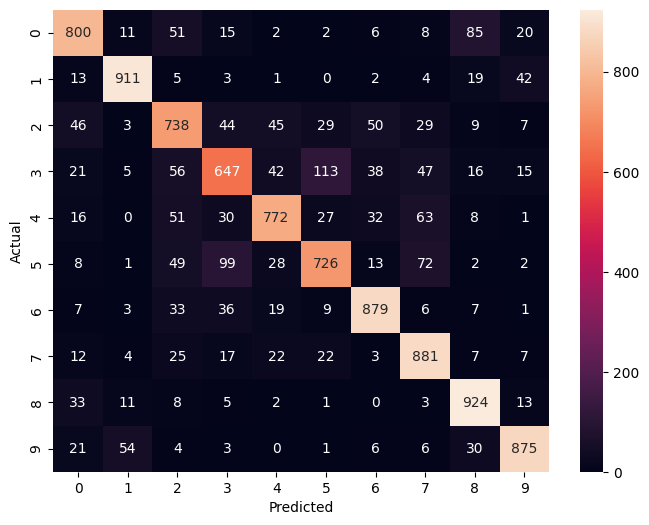

# 🧠 CIFAR-10 Image Classification using CNN (PyTorch)

This project builds a **Convolutional Neural Network (CNN)** using **PyTorch** to classify images from the **CIFAR-10 dataset**. The model is trained to recognize 10 different object categories such as airplanes, cars, birds, cats, deer, dogs, frogs, horses, ships, and trucks.

The project demonstrates a full deep learning pipeline including data preprocessing, augmentation, CNN architecture design, training, evaluation, confusion matrix analysis, and experimentation to reduce overfitting. 

## 📌 Table of Contents
- [Project Overview](#project-overview)
- [Technologies Used](#technologies-used)
- [Dataset](#dataset)
- [Data Preprocessing & Augmentation](#data-preprocessing--augmentation)
- [Model Architecture](#model-architecture)
- [Model Experiments](#model-experiments)
- [Training Process](#training-process)
- [Evaluation](#evaluation)
- [Confusion Matrix](#confusion-matrix)
- [Project Structure](#project-structure)
- [How to Run](#how-to-run)
- [Future Improvements](#future-improvements)

## 📊 Project Overview

The goal is to classify CIFAR-10 images using a CNN built from scratch in PyTorch. The model learns hierarchical features from raw pixels using convolutional layers.

## 🛠 Technologies Used

- Python
- PyTorch
- Torchvision
- NumPy
- Matplotlib
- Seaborn
- Scikit-learn

## 🗂 Dataset

- CIFAR-10 dataset
- 10 classes: airplane, car, bird, cat, deer, dog, frog, horse, ship, truck
- Image size: 32x32 RGB
- 50,000 training images
- 10,000 test images

## 🔄 Data Preprocessing & Augmentation

- RandomCrop (32, padding=4)
- RandomHorizontalFlip
- ToTensor
- Normalization using CIFAR-10 mean and std

## 🧠 Model Architecture

- Conv2D (3 → 32)
- Conv2D (32 → 64)
- Conv2D (64 → 128)
- Conv2D (128 → 128)
- MaxPooling layers
- Fully Connected: 3200 → 256 → 128 → 10
- Dropout: 0.3
- Output: LogSoftmax

## 🔬 Model Experiments

### Initial Model (Overfitting Issue)
- 2 convolutional layers
- 25 epochs
- High training accuracy but low test accuracy
- Clear overfitting problem

### Improved Model
To fix overfitting and improve generalization:

- Increased layers: 2 → 4 Conv layers
- Increased epochs: 25 → 50
- Increased batch size: 32 → 64
- Added Dropout (0.3)
- Added Weight Decay (1e-4)
- Used Adam optimizer (lr = 0.001)

Result:
- Reduced overfitting
- Better generalization
- More stable test accuracy

## 🚀 Training Process

- Loss Function: CrossEntropyLoss
- Optimizer: Adam
- Batch Size: 64
- Epochs: 50
- Device: Apple(Mac) MPS

Training uses backpropagation and gradient descent to minimize loss.

## 📈 Evaluation

- Training Accuracy
- Test Accuracy
- Model generalization improved after regularization

## 📊 Confusion Matrix

- Used to analyze classification errors
- Diagonal = correct predictions
- Off-diagonal = misclassifications
- Visualized using Seaborn heatmap 




## 📂 Project Structure

```text
CIFAR10-CNN-Classification
│
├── images/
│   └── confusion_matrix.png
│
├── .gitignore
├── CIFAR10_cnn.ipynb
└── README.md
```

## ▶️ How to Run

### Clone Repository
git clone https://github.com/sushil0126/CIFAR10-CNN-Classification.git 

### Install Dependencies
pip install torch torchvision numpy matplotlib seaborn scikit-learn

### Run Training
jupyter notebook


## 🔮 Future Improvements

- Add Batch Normalization
- Use ResNet or pretrained models (Transfer Learning)
- Add learning rate scheduler
- Try Cutout / Mixup augmentations
- Deploy using Streamlit app